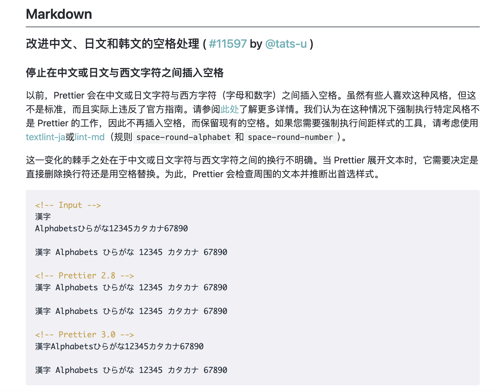

# prettier-plugin-lint-md

[](https://www.npmjs.com/package/prettier-plugin-lint-md)
[](https://github.com/lint-md/prettier-plugin/actions/workflows/ci.yml)
[](./LICENSE.txt)


让 Prettier 格式化后的 Markdown 符合中文排版规范。

## 为什么需要这个插件？

[Prettier 3](https://prettier.io/blog/2023/07/05/3.0.0.html#stop-inserting-spaces-between-chinese-or-japanese-and-western-characters) 不再自动在中文、日文与西文字符之间插入空格。这个决定适合 Prettier 的整体用户群体。中文技术文档通常仍希望保留这类排版规则。



这个插件会在 Prettier 格式化前调用 `@lint-md/core`，自动修复相关的中文排版问题。

> 相关讨论：[Markdown: Add an option to re-enable Prettier 2.x's automatic space insertion in CJK](https://github.com/prettier/prettier/issues/15015)

## 快速开始

安装插件：

```sh
pnpm add -D prettier prettier-plugin-lint-md
```

在 Prettier 配置中启用插件：

```js
export default {
  plugins: ['prettier-plugin-lint-md'],
};
```

这就是完整的基础配置。插件默认启用全部 16 条可自动修复规则，包括中西文空格、数字空格、中文标点、省略号、空链接和代码块等常见问题。只有需要调整个别规则时，才需要添加额外配置。

安装、配置、默认规则和 Node.js API 请阅读[完整文档](https://lint-md.github.io/prettier-plugin/)。

[GitHub](https://github.com/lint-md/prettier-plugin) · [问题反馈](https://github.com/lint-md/prettier-plugin/issues) · [参与贡献](./CONTRIBUTING.md) · [安全策略](./SECURITY.md) · [MIT License](./LICENSE.txt)
